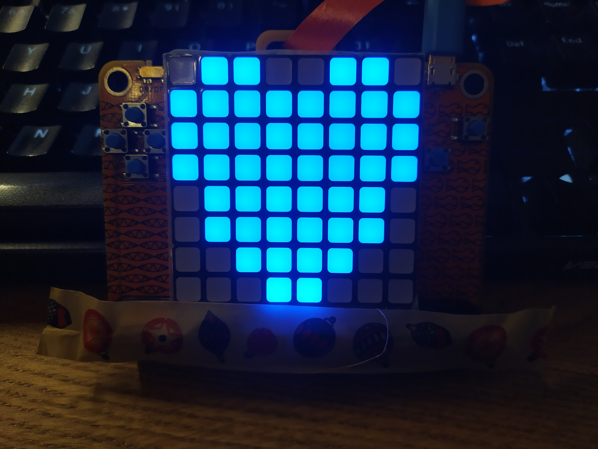

# pewpew_collection

* Check the [code/](code/) directory to see all the examples used in the talk
  and project.
* Check the [materials/](materials/) directory to get the information related
  components, configuration, photos, and more!

## Tie fighter

## Hearth
 

